# 🧩 Dungeon of Records

> 2025년 1학기 아주대학교 **게임엔진프로그래밍** 팀 프로젝트

---

## 🎮 프로젝트 개요

**Dungeon of Records**는 카드를 활용해 적의 웨이브를 막아내는 **로그라이크 핵 앤 슬래시형 생존 게임**입니다.
각 카드에는 고유한 능력과 쿨타임이 존재하며, 웨이브 종료 시 새로운 카드를 선택하여 덱을 강화해 나갑니다.

플레이어는 전략적인 카드 사용과 능동적인 전투로 몰려오는 적들을 물리치며 생존해야 합니다.

역할 분담
- 박태민 : 게임 스테이지, 몬스터 및 플레이어 로직
- 박민정 : 게임 Scene 관리, 전체 UI 개발

---

## ⚙️ 개발 환경

* **엔진**: Unity
* **언어**: C#
* **플랫폼**: PC (Windows / macOS)

---

## 🧠 개발 목표 및 주안점

* 자원의 효율적 관리 (객체 풀링, 파티션 충돌 처리)
* 카드 데이터 구조의 체계적 관리 (ScriptableObject + View 분리)
* 부드럽고 직관적인 카드 UI 구현
* 실시간 웨이브 기반 전투 시스템 구축

---
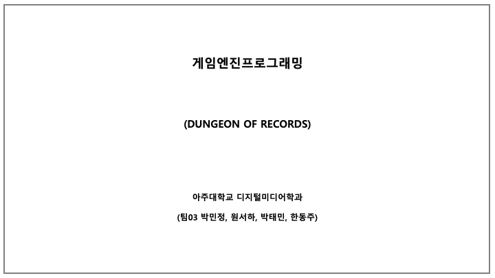
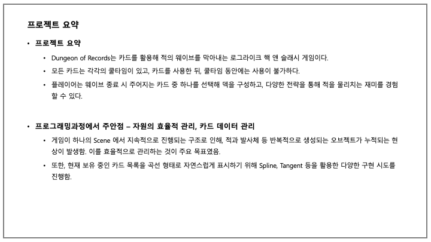
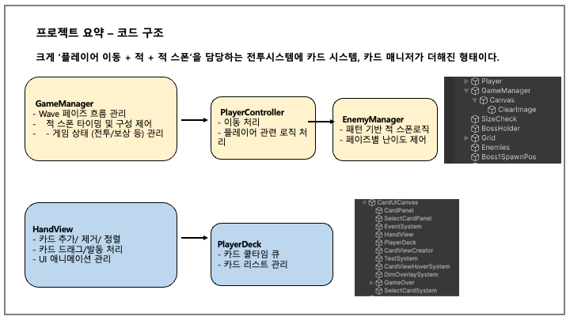
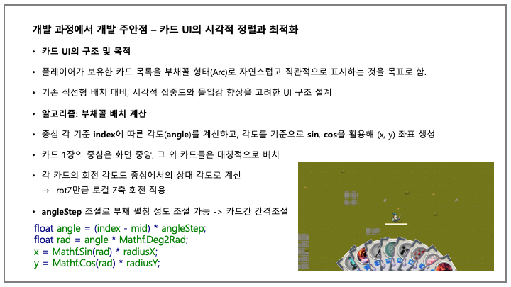
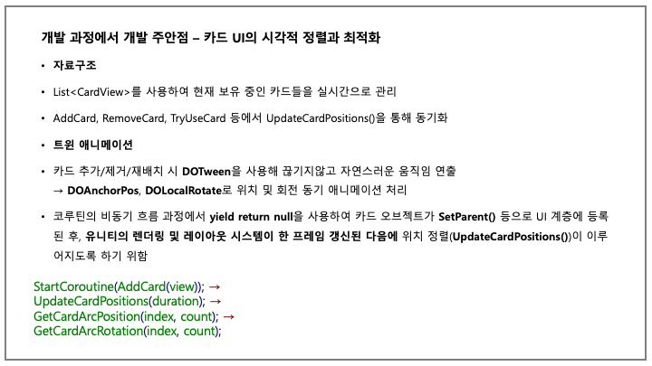
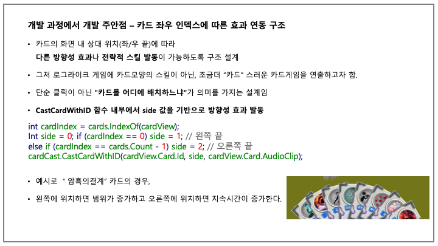
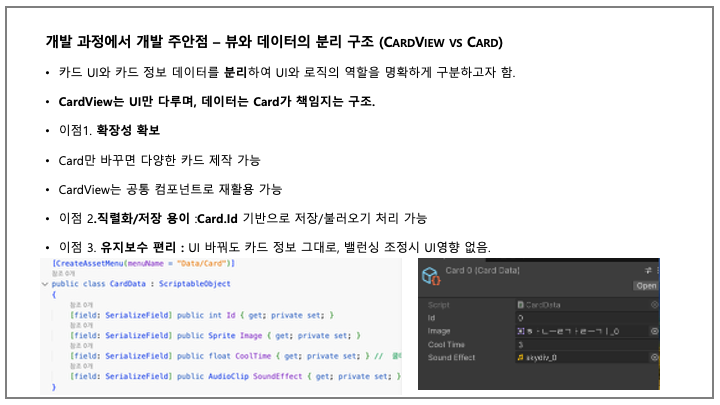
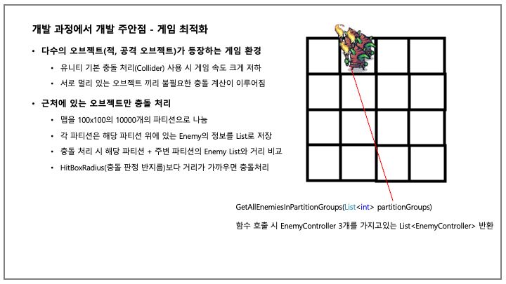
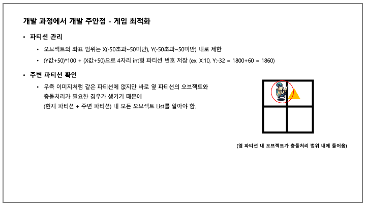
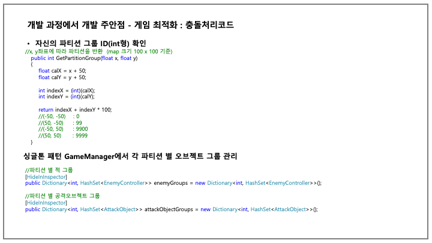
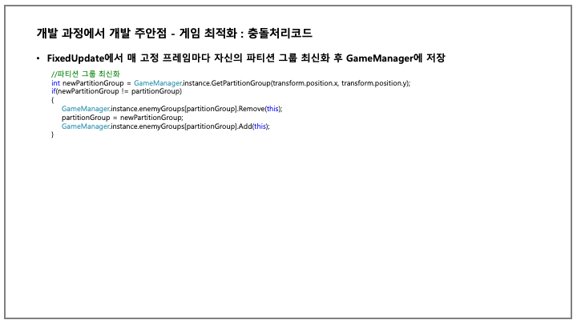
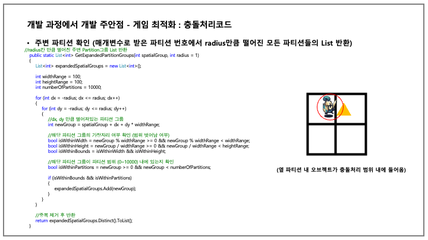
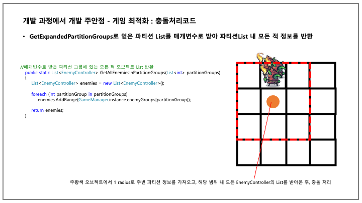
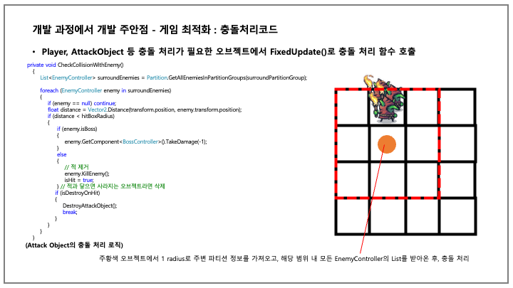
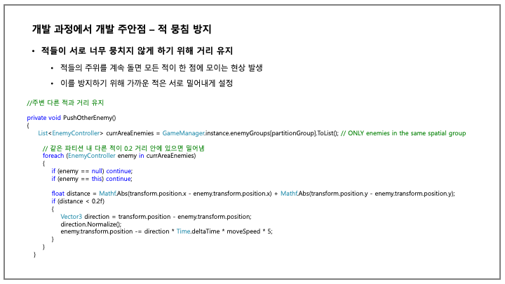
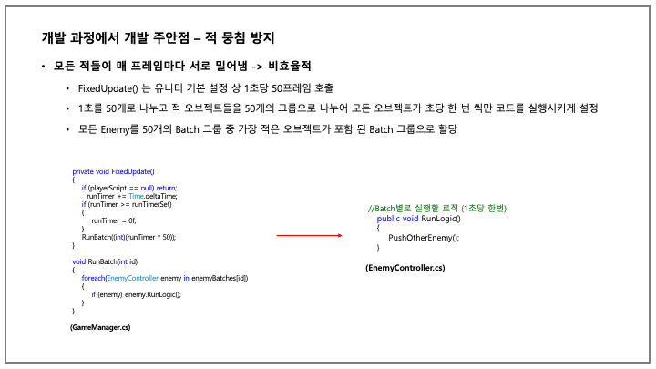
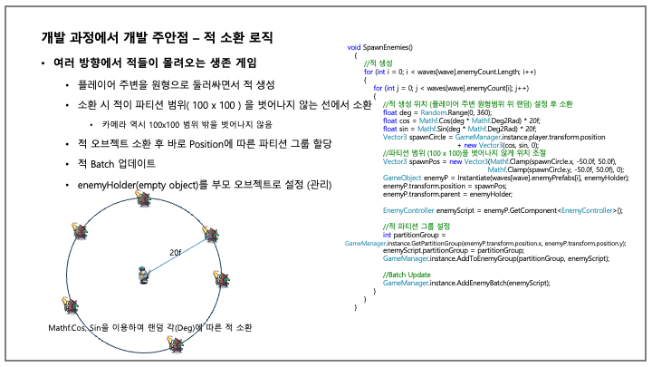
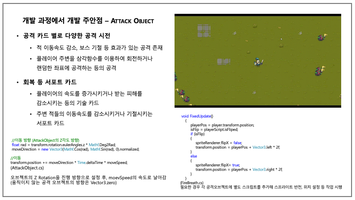

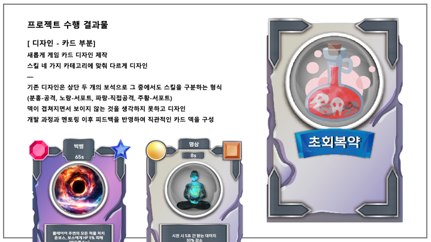

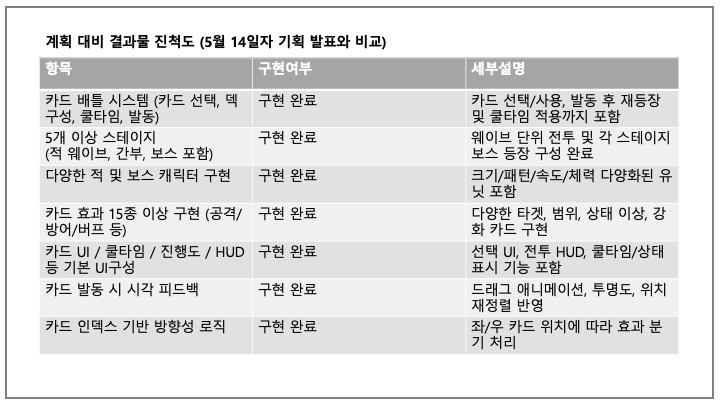
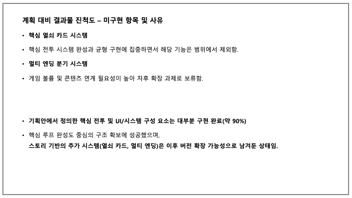
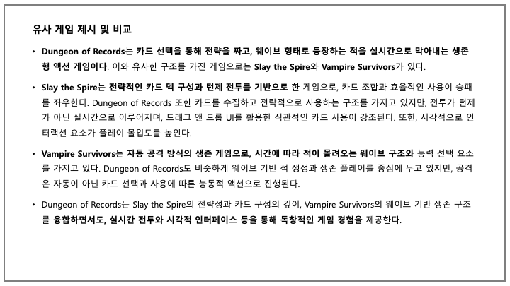
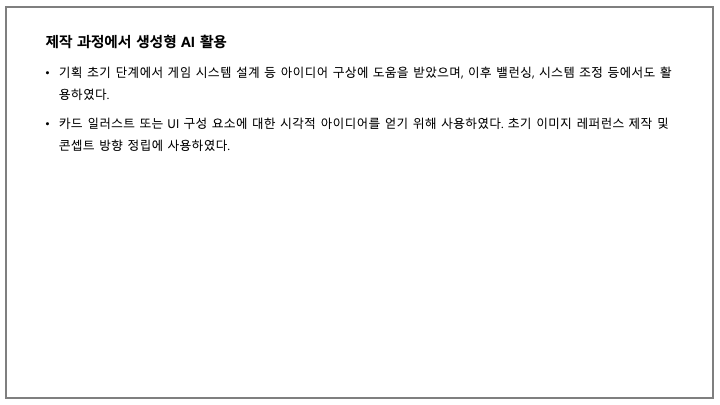
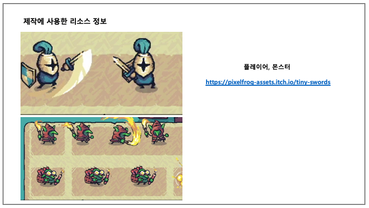
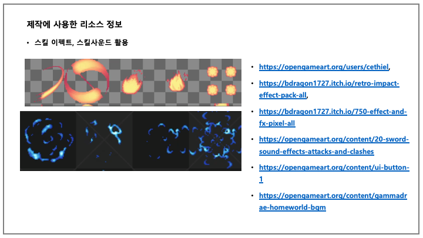

