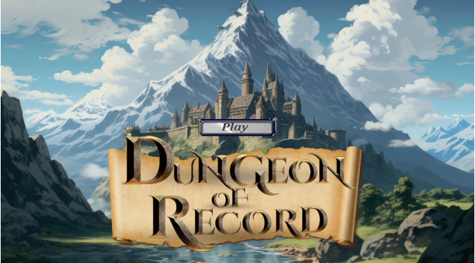
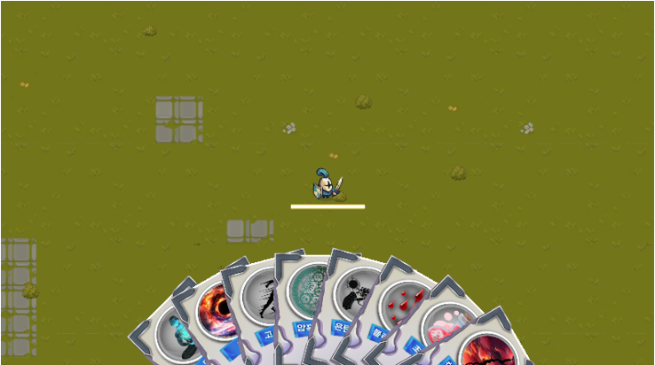
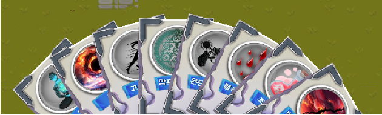

# 🧩 Dungeon of Records

> 2025년 1학기 아주대학교 **게임엔진프로그래밍** 팀 프로젝트

---

## 🎮 프로젝트 개요

**Dungeon of Records**는 카드를 활용해 적의 웨이브를 막아내는 **로그라이크 핵 앤 슬래시형 생존 게임**입니다.
각 카드에는 고유한 능력과 쿨타임이 존재하며, 웨이브 종료 시 새로운 카드를 선택하여 덱을 강화해 나갑니다.

플레이어는 전략적인 카드 사용과 능동적인 전투로 몰려오는 적들을 물리치며 생존해야 합니다.

---

## ⚙️ 개발 환경

* **엔진**: Unity
* **언어**: C#
* **플랫폼**: PC (Windows / macOS)

---

## 🧠 개발 목표 및 주안점

* 자원의 효율적 관리 (객체 풀링, 파티션 충돌 처리)
* 카드 데이터 구조의 체계적 관리 (ScriptableObject + View 분리)
* 부드럽고 직관적인 카드 UI 구현
* 실시간 웨이브 기반 전투 시스템 구축

---

## 🕹 주요 시스템 구성

### 1. 게임 구조

```
GameManager  → 웨이브 관리 / 적 스폰 / 게임 상태 제어
PlayerController → 이동, 공격, 피격 처리
EnemyManager → 적 AI / 패턴 기반 스폰 / 난이도 조절
HandView → 카드 추가·삭제·정렬 / 드래그·드랍 처리
PlayerDeck → 카드 쿨타임 큐 / 덱 관리
```

---

## 🃏 카드 시스템

### ▪ 카드 데이터 구조

* `ScriptableObject`를 이용해 카드 속성(이름, 효과, 쿨타임, 사운드 등) 관리
* `CardView`는 UI 표현만 담당, `Card`는 실제 효과와 데이터만 관리
* UI 변경과 무관하게 밸런스 수정 가능

### ▪ 카드 시각적 정렬

* `List<CardView>`로 보유 카드 관리
* `UpdateCardPositions()`에서 **부채꼴(Arc)** 형태로 정렬
* 각도 계산:

  ```csharp
  float angle = (index - mid) * angleStep;
  float rad = angle * Mathf.Deg2Rad;
  x = Mathf.Sin(rad) * radiusX;
  y = Mathf.Cos(rad) * radiusY;
  ```
* **DOTween**을 이용해 카드 이동·회전 시 자연스러운 트윈 애니메이션 처리

### ▪ 좌/우 인덱스 기반 효과

* 카드 위치(왼쪽·오른쪽)에 따라 스킬 효과가 달라짐

  ```csharp
  if (index == 0) side = 1;   // 왼쪽 끝 → 범위 증가  
  if (index == last) side = 2; // 오른쪽 끝 → 지속시간 증가  
  ```
* 카드의 배치 자체가 전략적 의미를 갖도록 설계

---

## ⚔️ 전투 및 최적화 구조

### ▪ 파티션 기반 충돌 처리

* 맵을 `100x100` 구역으로 나눠 각 오브젝트의 위치를 파티션 단위로 관리
* 충돌 계산 시 **자신이 속한 파티션 + 주변 파티션**만 탐색하여 오버헤드 최소화
* `Dictionary<int, HashSet<EnemyController>> enemyGroups`로 그룹 관리

### ▪ 충돌 탐색 로직

```csharp
int group = GetPartitionGroup(x, y);
List<int> nearby = GetExpandedPartitionGroups(group, radius=1);
foreach (var enemy in GetAllEnemiesInPartitionGroups(nearby)) {
    if (Vector2.Distance(pos, enemy.pos) < hitBoxRadius)
        enemy.KillEnemy();
}
```

### ▪ 적 밀집 방지 로직

* 가까운 적끼리 서로 밀어내어 겹침 현상 방지
* `PushOtherEnemy()`로 같은 파티션 내 근접한 적 위치 보정
* 전체 적을 50개 **Batch 그룹**으로 분할해, 프레임마다 일부만 처리 → CPU 부하 감소

---

## 💥 공격 및 보조 오브젝트 (Attack Object)

* 카드별 다양한 공격 오브젝트를 생성 (투사체, 회전형, 범위형 등)
* 이동 방향은 `transform.rotation`의 Z각도로 설정
* 특정 카드 효과:

  * **보스 기절**, **적 속도 감소**, **플레이어 회복**, **방어 강화** 등
  * `moveDirection = new Vector3(Mathf.Cos(rad), Mathf.Sin(rad), 0)`

---

## 👁 UI / UX

* 카드 UI는 카메라 기준으로 고정되어 항상 하단에 표시
* 카드 사용 시 드래그 & 드랍 애니메이션
* 카드 호버 시 확대 및 상세 설명 표시
* 일시정지/보상 선택/HP 바 등 핵심 HUD 완비

---

## 🧩 게임 진행 구조

1. **게임 시작** → 첫 웨이브 시작
2. **적 처치 후 웨이브 종료** → 일시정지 및 보상 카드 선택
3. **선택된 카드 덱에 추가**
4. **다음 웨이브 진행** (점점 난이도 상승)
5. **보스 웨이브 클리어 시 엔딩 화면 출력**


---

## 🎥 시연 장면


타이틀 화면


게임 시작 직후 화면


카드 덱 배치 


---

## 🧩 유사 게임 비교

| 게임                     | 유사점           | 차별점                  |
| ---------------------- | ------------- | -------------------- |
| **Slay the Spire**     | 카드 선택 및 전략 중심 | 실시간 전투 + 드래그 앤 드롭 UI |
| **Vampire Survivors**  | 웨이브 기반 생존 구조  | 자동 공격 대신 능동적 카드 사용   |
| **Dungeon of Records** | 위 두 구조의 융합    | 실시간 전투와 시각적 몰입감 강화   |

---

## 🪄 생성형 AI 활용

* 게임 콘셉트 및 시스템 구상 시 아이디어 보조
* 카드 일러스트 및 UI 콘셉트 참고 이미지 제작
* 밸런스 튜닝 및 난이도 설계에도 일부 활용

---

## 🧱 사용 리소스

* **캐릭터/몬스터**: [Pixel Frog - Tiny Swords](https://pixelfrog-assets.itch.io/tiny-swords)
* **이펙트/사운드**:

  * [bdragon1727 FX Pack](https://bdragon1727.itch.io/retro-impact-effect-pack-all)
  * [OpenGameArt Sound Pack](https://opengameart.org/content/20-sword-sound-effects-attacks-and-clashes)
  * [UI Button Sounds](https://opengameart.org/content/ui-button-1)
  * [Gammadrae BGM](https://opengameart.org/content/gammadrae-homeworld-bgm)

---
