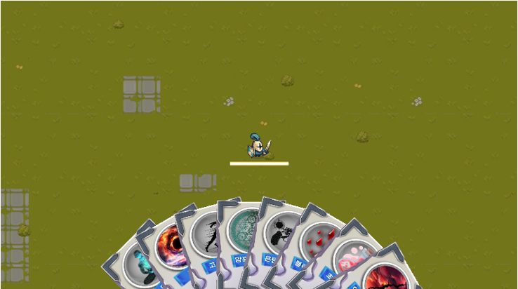

# 2025년 1학기 유니티 프로젝트

## 🎮 프로젝트 개요
본 프로젝트는 2025년 1학기 **게임엔진프로젝트** 수업에서 진행된 유니티 기반 게임 개발 과제입니다.

개발 2명, 디자인 1명, 기획 1명.

## 🛠️ 개발 환경
- Unity 
- C#
- 플랫폼: PC (Windows, macOS)

## 📌 주요 기능
- 적 웨이브 기반 전투 시스템
- 카드 기반 능력 사용 시스템
- 플레이어 HP/데미지 처리
- 게임 일시정지 및 카드 선택 UI
- 드래그 앤 드랍 카드 사용
- 카드 호버 시 정보 표시

## 📷 게임 화면

> *실제 플레이 장면*